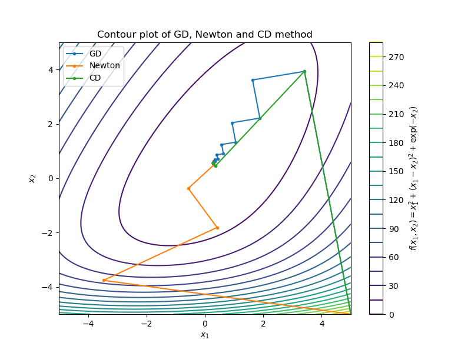
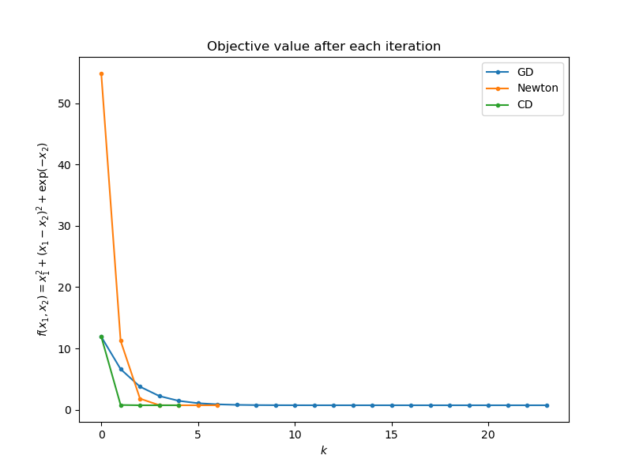

# Gradient Decent Method, Newton Method and Conjugate Gradient Method

- Test function: $f(x_1, x_2) = x_1^2 + (x_1 - x_2)^2 + \exp(-x_2)$
- Initial point: $(5, -5)$
- Methods:
  - Gradient Decent Method: $\bm{d}^k = -\nabla f(\bm{x}^k)$
  - Newton Method: $\bm{d}^k = -\nabla^2 f(\bm{x}^k)^{-1} \nabla f(\bm{x}^k)$
  - Conjugate Gradient Method: $\bm{d}^k = -\nabla f(\bm{x}^k) + \beta^k \bm{d}^{k-1}$ where $\beta^k$ is designed to make $\bm{d}^k$ and $\bm{d}^{k-1}$ conjugate with respect to $\nabla^2 f(\bm{x}^k)$

The following two figures showed outcomes of the three methods.




```python
import numpy as np
import matplotlib.pyplot as plt
import scipy as sp


def f(x1, x2):
    return 2 * x1 ** 2 + x2 ** 2 - 2 * x1 * x2 + np.exp(-x2)


def df(x1, x2):
    return np.array([[4 * x1 - 2 * x2], [2 * x2 - 2 * x1 - np.exp(-x2)]])


def d2f(x1, x2):
    return np.array([[4, -2],
                     [-2, 2 + np.exp(-x2)]])


def exact_line_search(init_x1, init_x2, dx1, dx2):
    # return 0.2 / np.sqrt(dx1 ** 2 + dx2 ** 2) # fixed step size
    res = sp.optimize.minimize(lambda alpha: f(init_x1 + alpha * dx1, init_x2 + alpha * dx2), 0, tol=1e-10)
    return res.x[0]


def gradient_decent(init_x1, init_x2, eps=1e-2, K=100):
    error = np.inf
    x1 = init_x1
    x2 = init_x2
    points = [[x1, x2]]
    k = 1
    while error > eps and k < K:
        d = df(x1, x2)
        direction = - d
        step_size = exact_line_search(x1, x2, direction[0, 0], direction[1, 0])
        step = step_size * direction
        x1 += step[0, 0]
        x2 += step[1, 0]
        points.append([x1, x2])
        error = np.linalg.norm(d, 2)
        k += 1
    return np.array(points)


def newton_method(init_x1, init_x2, eps=1e-2, K=100):
    error = np.inf
    x1 = init_x1
    x2 = init_x2
    points = [[x1, x2]]
    k = 1
    while error > eps and k < K:
        d = df(x1, x2)
        d2 = d2f(x1, x2)
        direction = - np.linalg.inv(d2) @ d
        step_size = exact_line_search(x1, x2, direction[0, 0], direction[1, 0])
        step = step_size * direction
        x1 += step[0, 0]
        x2 += step[1, 0]
        points.append([x1, x2])
        error = np.linalg.norm(d, 2)
        k += 1
    return np.array(points)


def conjugate_direction(init_x1, init_x2, eps=1e-2, K=100):
    error = np.inf
    x1 = init_x1
    x2 = init_x2
    points = [[x1, x2]]
    k = 1
    while error > eps and k < K:
        if k == 1:
            d = df(x1, x2)
            d2 = d2f(x1, x2)
            direction = - d
            step_size = exact_line_search(x1, x2, direction[0, 0], direction[1, 0])
            step = step_size * direction
        else:
            d = df(x1, x2)
            d2 = d2f(x1, x2)
            direction = - d + ((d.T @ d2 @ direction) / (direction.T @ d2 @ direction)) * direction
            step_size = exact_line_search(x1, x2, direction[0, 0], direction[1, 0])
            step = step_size * direction
        x1 += step[0, 0]
        x2 += step[1, 0]
        points.append([x1, x2])
        error = np.linalg.norm(d, 2)
        k += 1
    return np.array(points)


def calculate_objective_value(solution):
    return f(solution[:, 0], solution[:, 1])


def calculate_relative_error(solution):
    z = calculate_objective_value(solution)
    return np.abs(np.diff(z)) / z[-1]


if __name__ == '__main__':
    # Create a grid of parameter values
    x1 = np.linspace(-5, 5, 100)
    x2 = np.linspace(-5, 5, 100)
    x1, x2 = np.meshgrid(x1, x2)
    # Compute objective function values
    z = f(x1, x2)
    # GD, Newton, and CD
    x_init = (5, -5)
    eps = 1e-3
    K = 100
    GD_points = gradient_decent(x_init[0], x_init[1], eps, K)
    print("Solution of GD: \t x1 = {:.4f} \t x2 = {:.4f}".format(GD_points[-1, 0], GD_points[-1, 1]))
    newton_points = newton_method(x_init[0], x_init[1], eps, K)
    print("Solution of NT: \t x1 = {:.4f} \t x2 = {:.4f}".format(newton_points[-1, 0], newton_points[-1, 1]))
    CD_points = conjugate_direction(x_init[0], x_init[1], eps, K)
    print("Solution of CD: \t x1 = {:.4f} \t x2 = {:.4f}".format(CD_points[-1, 0], CD_points[-1, 1]))
    # Plot the contour
    _, ax = plt.subplots(figsize=(8, 6))
    cp = ax.contour(x1, x2, z, levels=20)
    plt.colorbar(cp, label='$f(x_1, x_2) = x_1^2 + (x_1 - x_2)^2 + \\exp(-x_2)$')
    ax.plot(GD_points[:, 0], GD_points[:, 1], marker='.', label='GD')
    ax.plot(newton_points[:, 0], newton_points[:, 1], marker='.', label='Newton')
    ax.plot(CD_points[:, 0], CD_points[:, 1], marker='.', label='CD')
    ax.set_xlabel('$x_1$')
    ax.set_ylabel('$x_2$')
    ax.set_title('Contour plot of GD, Newton and CD method')
    plt.legend()
    plt.show()
    # Plot the objective
    _, ax = plt.subplots(figsize=(8, 6))
    ax.plot(calculate_objective_value(GD_points)[1:], marker='.', label='GD')
    ax.plot(calculate_objective_value(newton_points)[1:], marker='.', label='Newton')
    ax.plot(calculate_objective_value(CD_points)[1:], marker='.', label='CD')
    ax.set_xlabel('$k$')
    ax.set_ylabel('$f(x_1, x_2) = x_1^2 + (x_1 - x_2)^2 + \\exp(-x_2)$')
    ax.set_title('Objective value after each iteration')
    plt.legend()
    plt.show()

```