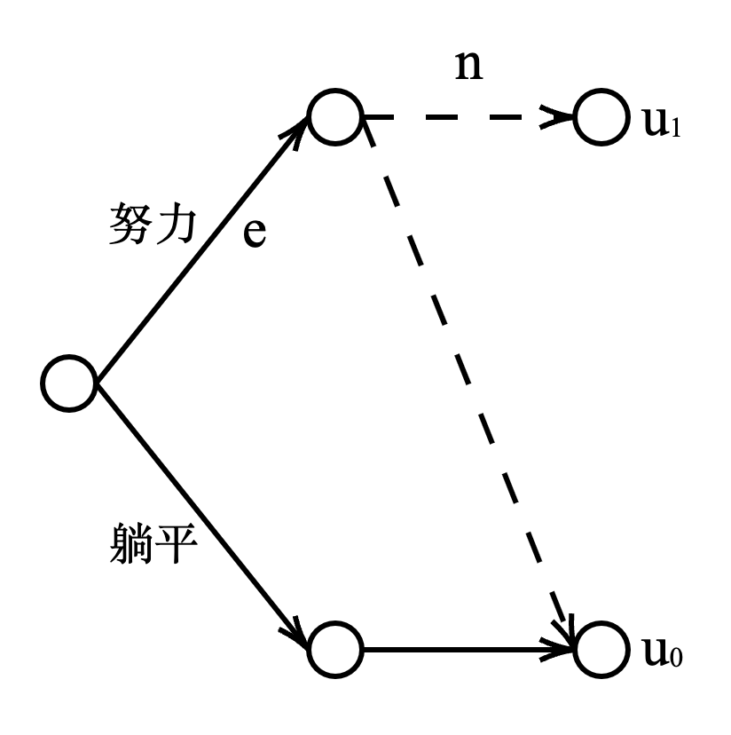

# 用经济学来解释内卷？

假设你面前有两条路，一条是努力，一条是躺平。由于资源的限制，努力的你不一定会收获好的结果，你会选择什么？

这个问题可以建模为一个博弈论问题，如下图所示。假设有$N$个人，每个人$j$有两种策略，努力（ $s_j=1$ ）或躺平（ $s_j=0$ ）。选择努力的人需要付出$e$的成本，而且由于资源的限制，只有最多$n$人能走上人生巅峰，收获$u_1$的效用；剩余的人只能和躺平的人一样，收获$u_0$的效用，且$u_1-e > u_0$。

于是，在纳什均衡点，如果资源充足（$n \geq N$），毫无疑问大家都会选择努力，时代充满了向上的氛围；但如果资源不足，平均来讲会有$\frac{u_1-u_0}{e} n = \left(1+\frac{(u_1-e)-u_0}{e}\right) n$人选择努力，剩余的人选择躺平。

当资源是有限时，社会最优的状态下应该只有$n$人选择努力，多出的这$\frac{(u_1-e)-u_0}{e} n$人付出了成本，但并未收获想要的生活，且加剧了竞争，这可能就是内卷吧。但这确是每个人理性选择的结果。

要想缓解内卷，要么就得把蛋糕做大，增大$n$，让资源更多一些；要么就得把蛋糕分好，增大$u_0$，让躺平者的生活能有保障，以此多一些安全感。